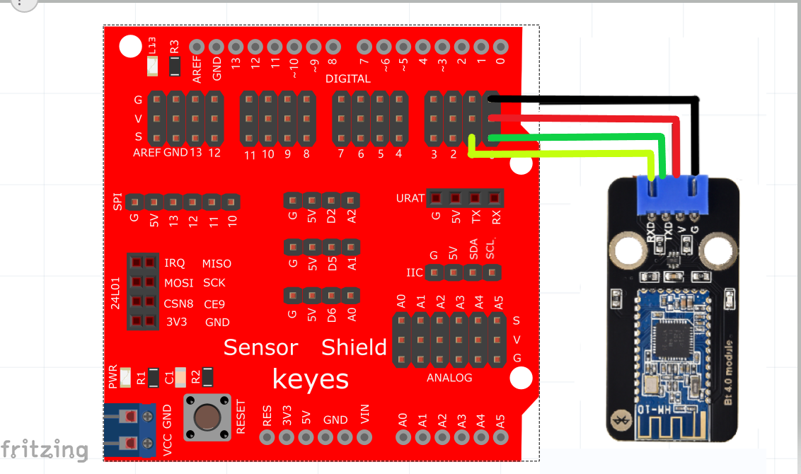
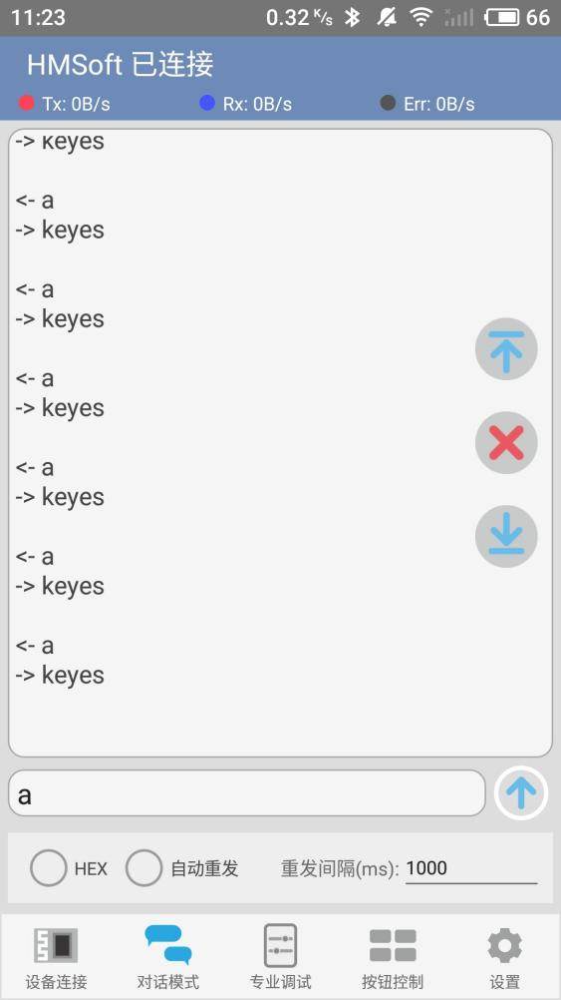

# Arduino


## 1. Arduino简介  

Arduino是一款开源电子原型平台，致力于使电子项目的开发变得更加简单和易于使用。它由可编程的硬件和软件构成，用户可以通过编写代码为其导入逻辑控制，进而实现各种创新应用。Arduino支持多种编程语言，但最常用的是C/C++，且伴随Arduino IDE（集成开发环境）的使用，使得学习和开发变得更加直观。  

Arduino的设计旨在让初学者和专业开发者都可以轻松接触和使用电子设备，具有丰富的社区支持，提供大量的教程、示例和开源库。无论是简单的LED闪烁、传感器读取，还是复杂的机器人项目，Arduino都能提供良好的解决方案。它广泛应用于教育、艺术、自动化、物联网等领域，极大促进了创意思维和动手能力的提升。  

## 2. 接线图  

  

## 3. 测试代码  

```cpp  
int val;  
int ledpin = 13;  

void setup() {  
    Serial.begin(9600);  
    pinMode(ledpin, OUTPUT);  
}  

void loop() {  
    val = Serial.read();  
    if (val == 'a') {  
        digitalWrite(ledpin, HIGH);  
        delay(250);  
        digitalWrite(ledpin, LOW);  
        delay(250);  
        Serial.println("keyes");  
    }  
}  
```

## 4. 代码说明  

## 4.1 导入库和设置  
- `Serial.begin(9600);`：设置串口波特率为9600，以便与蓝牙模块进行通信。  
- `pinMode(ledpin, OUTPUT);`：将引脚13设置为输出模式，用于控制LED。  

## 4.2 主循环  
使用`loop()`函数持续运行，读取串口输入：  
- `val = Serial.read();`：读取通过蓝牙发送的数据。  
- `if (val == 'a')`：如果读取到的字符是'a'，则执行以下操作。  
    - `digitalWrite(ledpin, HIGH);`：点亮LED。  
    - `delay(250);`：保持LED亮250毫秒。  
    - `digitalWrite(ledpin, LOW);`：熄灭LED。  
    - `delay(250);`：保持LED灭250毫秒。  
    - `Serial.println("keyes");`：通过串口输出"keyes"的信息。  

## 5. 测试结果  

在蓝牙调试助手中点击搜索设备并连接到配对的蓝牙模块，此时模块上的LED指示灯点亮。在HC-COM中输入字符'a'并发送，蓝牙APP将显示"keyes"，每次发送字符'a'时，Arduino主板上的引脚13 LED都会闪烁一次，测试效果如图所示。  

  




