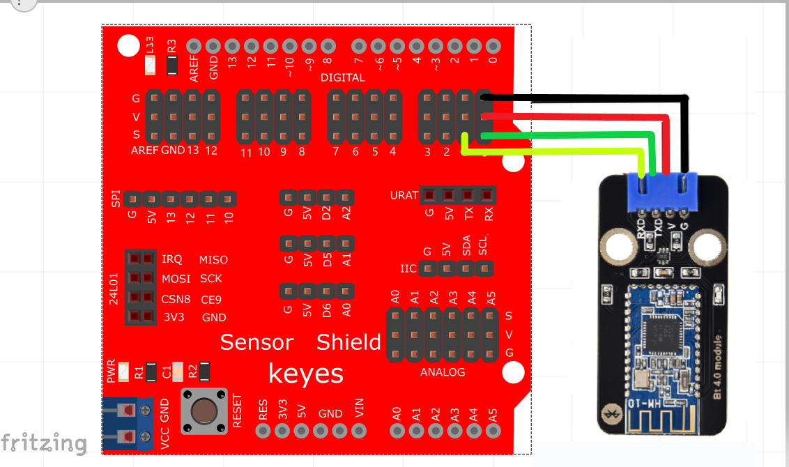
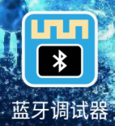

# KidsBlock

## 1. Kidsblock简介  

Kidsblock是一个基于图形化编程的学习平台，专为儿童和初学者设计，旨在让用户能够简单、直观地学习编程和电子学。通过使用拖放式的编程模块，用户可以创建互动项目和实验，而无需掌握复杂的编程语法。Kidsblock与多种硬件平台兼容，包括Arduino等，使得学习者可以在实践中提升他们的项目构建能力。  

该平台提供丰富的教程和支持，增强了动手能力和创造性思维的培养。Kidsblock强调简单易用，能够引导用户从基础知识逐步深入，帮助他们探索更复杂的编程概念和电子应用。  

## 2. 接线图  

  

| UNO主板 | 蓝牙模块 |  
|---------|----------|  
| 5V      | V        |  
| GND     | G        |  
| RX      | TX       |  
| TX      | RX       |  

## 3. 测试代码  

(无代码提供，但用户可在Kidsblock平台构建和调试项目。)  

## 4. 测试结果  

使用蓝牙调试助手搜索并连接到蓝牙模块。连接成功后，蓝牙模块上的LED指示灯会亮起。在HC-COM中输入字符'a'并发送，蓝牙APP将显示'a'，同时主板上的Pin13 LED会亮起；当HC-COM发送字符'b'时，APP将显示'b'，主板上的Pin13 LED将熄灭。  

