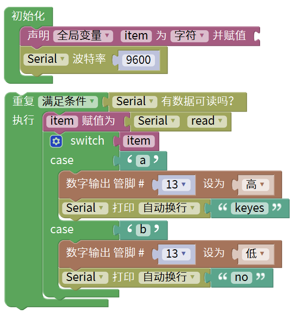
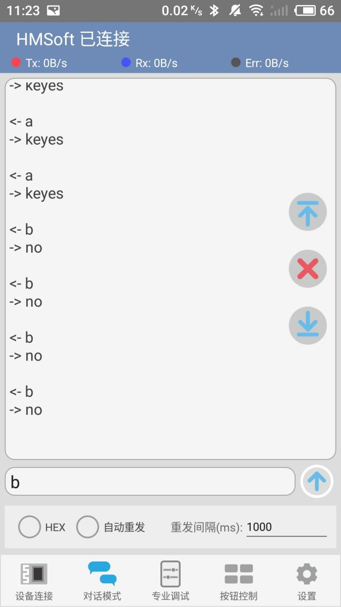

# Mixly

## 1. Mixly简介  

Mixly是一个基于Scratch的图形化编程平台，旨在为初学者，特别是儿童，提供一个简单、易于理解的编程环境。通过图形化的积木式设计，用户可以通过拖拽不同类型的编程块来构建项目，这大大降低了学习编程的门槛，并引导用户逐步掌握编程逻辑与思维。  

Mixly支持多种硬件平台，包括Arduino、ESP8266等，适用于各种创意电子项目。该平台包含大量的编程模块，用户可以轻松实现LED控制、传感器读取、马达控制等功能。Mixly还支持代码生成，可以将图形化编程转换为Arduino C语言代码，方便用户进行更深入的学习和实践。  

## 2. 接线图  

  

## 测试代码（测试软件：mixly1.2.0）  

  

## 3. 测试结果  

使用蓝牙调试助手，搜索并连接到蓝牙模块，连接成功后蓝牙模块的LED指示灯会亮起。在HC-COM中输入字符'a'并发送，蓝牙APP将显示"keyes"。主板上的Pin13 LED会亮起；当HC-COM发送字符'b'时，APP将显示"no"，同时主板上的Pin13 LED将熄灭。  

