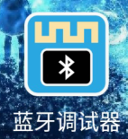

# Python


## 1. Python简介  

Python是一种高级编程语言，由Guido van Rossum于1991年首次发布。它以简单易读的语法和强大的功能著称，适合于初学者和专业开发者。Python支持多种编程范式，包括面向对象编程和结构化编程，此外，它还具备丰富的标准库，涵盖了数据分析、机器学习、Web开发、自动化脚本等多个领域。  

Python因其强大的社区支持和广泛的应用领域而受到广泛欢迎。无论是在科学计算、数据分析，还是在人工智能和网络开发，Python都表现出极大的灵活性和适应性，使其成为当今最流行的编程语言之一。  

## 2. 接线图  

  

## 3. 测试代码（测试软件版本：arduino-1.8.12）  

```python  
from machine import UART, Pin  
import utime  

uart = UART(0, baudrate=9600, tx=Pin(0), rx=Pin(1))  
led = Pin(25, Pin.OUT)  

uart.write("Waveshare Uart Test\r\n")  
uart.write("Please enter character 0 or 1 to switch the LED on and off\r\n")  

while True:  
    if uart.any() != False:  
        buf = uart.read(1)  
        if buf == b'1':  
            led.toggle()  
            print("LED ON")  
            uart.write("LED ON\r\n")  
        elif buf == b'0':  
            led.low()  
            print("LED OFF")  
            uart.write("LED OFF\r\n")  
        else:  
            print("Please enter character 0 or 1 to switch the LED on and off")  
            uart.write("Please enter character 0 or 1 to switch the LED on and off\r\n")  
```  

## 4. 测试结果  

使用蓝牙调试助手搜索并连接到蓝牙模块，连接成功后蓝牙模块的LED指示灯会亮起。在HC-COM中输入字符'1'并发送，树莓派PICO的板载LED亮起，同时串口显示"LED ON"；当输入字符'0'并发送时，板载LED熄灭，串口显示"LED OFF"。  




